# 💬 Chat App - Real-Time Communication

Microservices-based chat & calling platform. Real-time messaging, voice/video calls, OTP auth, email notifications.

---

## 🛠️ Technology Stack

### Backend

<table align="center">
<tr>
<td align="center">
 FastAPI
</td>

<td align="center">
 Socket.IO
</td>

<td align="center">
 MongoDB
</td>

<td align="center">
 Motor
</td>
</tr>

<tr>
<td align="center">
 Redis
</td>

<td align="center">
 RabbitMQ
</td>

<td align="center">
 SendGrid
</td>

<td align="center">
 VideoSDK
</td>
</tr>

<tr>
<td align="center">
 Uvicorn
</td>

<td align="center">
 Python
</td>

<td align="center">
 Docker
</td>
</tr>

</table>

### Frontend

<table align="center">
<tr>
<td align="center">
 React
</td>

<td align="center">
 Vite
</td>

<td align="center">
 TypeScript
</td>

<td align="center">
 Tailwind CSS
</td>
</tr>

<tr>
<td align="center">
 Zustand
</td>

<td align="center">
 Socket.IO Client
</td>

<td align="center">
 Axios
</td>
</tr>
</table>

---

## 📋 Services

| Service | Port | Tech |
|---------|------|------|
| **User** | 8000 | FastAPI + MongoDB + Redis |
| **Chat** | 8002 | FastAPI + Socket.IO + MongoDB |
| **Call** | 8003 | FastAPI + Socket.IO + VideoSDK |
| **Mail** | 8001 | FastAPI + RabbitMQ + SendGrid |

---

## 🔒 Core Features

✅ Real-time messaging (Socket.IO)  
✅ Voice/video calls (VideoSDK)  
✅ OTP + JWT authentication  
✅ File uploads  
✅ Call history  
✅ Email notifications (SendGrid)  
✅ Async tasks (RabbitMQ)  
✅ Session caching (Redis)  
✅ Containerized (Docker)  

---

## 🎯 Overview

**Chat App** is a comprehensive real-time communication platform that combines instant messaging with high-quality voice and video calling. Built with a modern microservices architecture, it separates concerns into independent, scalable services while maintaining data integrity and security across the platform.

### Key Capabilities:
- **Real-time Messaging** - Instant chat with Socket.IO WebSocket support
- **Voice & Video Calls** - Peer-to-peer calling via VideoSDK
- **User Authentication** - Secure OTP-based login with JWT tokens
- **Email Notifications** - Transactional emails via SendGrid
- **Message Queue Processing** - Asynchronous task handling with RabbitMQ
- **High-Performance Caching** - Redis for sessions and data caching
- **Container Orchestration** - Docker for consistent deployment
- **Horizontal Scalability** - Microservices architecture for independent scaling

---

## 🏗️ Architecture

### System Architecture Diagram

  

### Backend Technologies

| Layer | Technology | Purpose | Version |
|-------|-----------|---------|---------|
| **Framework** | FastAPI | High-performance async Python web framework | 0.104+ |
| **Server** | Uvicorn | ASGI server for running FastAPI applications | 0.24+ |
| **Real-time** | Socket.IO (python-socketio) | WebSocket communication for messaging & calls | 5.9+ |
| **Database** | MongoDB | NoSQL document database for scalable data storage | 5.0+ |
| **Async Driver** | Motor | Async MongoDB driver for FastAPI | 3.3+ |
| **Authentication** | Python-Jose | JWT token generation and validation | 3.3+ |
| **Email Service** | SendGrid | Email delivery for notifications and transactional emails | - |
| **Message Queue** | RabbitMQ | Asynchronous task queue for background jobs | 3.12+ |
| **Caching** | Redis | In-memory cache for sessions and real-time data | 7.0+ |
| **Containerization** | Docker | Container platform for deployment and scalability | 24+ |
| **Video/Audio** | VideoSDK | Third-party service for peer-to-peer media streaming | - |

### Frontend Technologies

| Layer | Technology | Purpose | Version |
|-------|-----------|---------|---------|
| **Framework** | React | UI component library and state management | 18+ |
| **Build Tool** | Vite | Fast build tool and development server | 5.0+ |
| **Language** | TypeScript | Type-safe JavaScript for better code quality | 5.0+ |
| **Styling** | Tailwind CSS | Utility-first CSS framework | 3.3+ |
| **State Management** | Zustand | Lightweight state management library | 4.4+ |
| **Real-time** | Socket.IO Client | WebSocket client for real-time communication | 4.5+ |
| **HTTP Client** | Axios | Promise-based HTTP client for API calls | 1.6+ |
| **Video Call** | VideoSDK.live | Client SDK for video calling integration | - |

### Infrastructure & DevOps

| Component | Technology | Purpose |
|-----------|-----------|---------|
| **Containerization** | Docker | Package applications with dependencies |
| **Orchestration** | Docker Compose | Multi-container orchestration for development |
| **Version Control** | Git | Source code management |
| **CI/CD** | GitHub Actions (Optional) | Automated testing and deployment |

---

## 📝 License

This project is licensed under the MIT License - see the LICENSE file for details.

---

## 👥 Support & Contact

For questions, issues, or suggestions:
- Open an issue on GitHub

---

**Last Updated:** May 16, 2026  
**Status:** ✅ Production Ready
